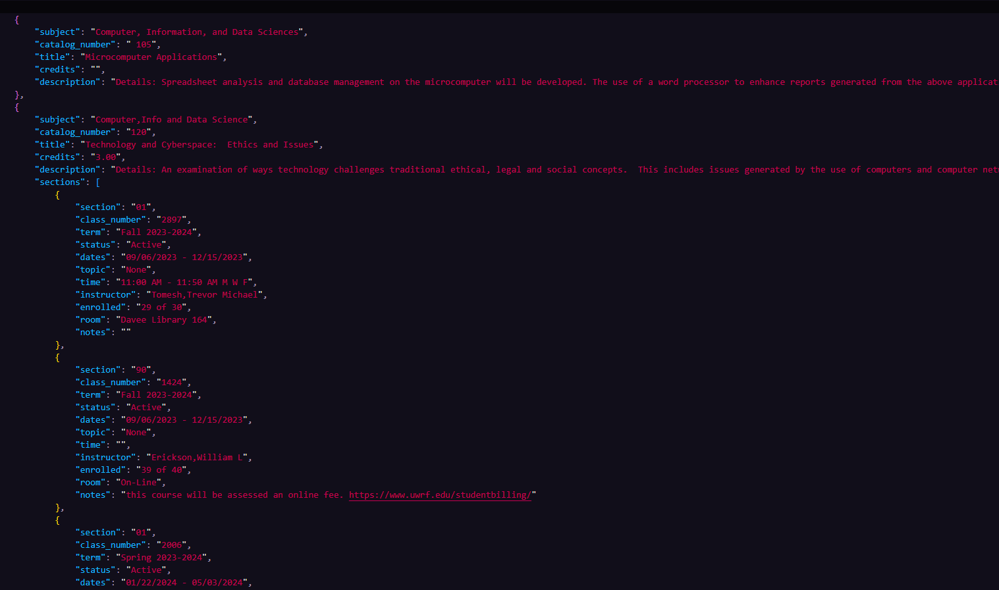

# Course Parser for UWRF CIDS

Simple web scraper written in go. 

Professor in CIDS Discord asked for an app that scrapped this [page](https://www.uwrf.edu/ClassSchedule/DepartmentCourses.cfm?subject=CIDS)
and returned all data in json format. 

### How to Use
1. Clone the repository to your local environment

2. In your terminal of choice, navigate to the root directory of this program

3. Run the following in your command line:
```$ go run .```

When finished, you should have a file in the root directory called ```classes.json``` and it should have data like this:


